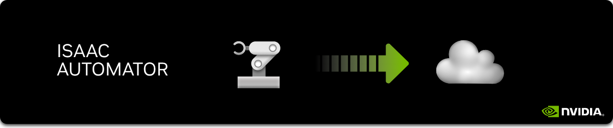

# Isaac Automator (v3)

Isaac Automator allows a quick deployment of Isaac Sim and Isaac Lab to the public clouds (AWS, GCP, Azure, and Alibaba Cloud are currently supported).

The result is a fully configured remote-desktop cloud workstation, which can be used for development and testing of the robotic applications within minutes and on a budget. Isaac Automator supports varierty of GPU instances and stop-start functionality to save on cloud costs, provides tools to aid the workflow (uploading and downloading data, autorun, deployment management, etc).

- [Installation](#installation)
  - [Installing Docker](#installing-docker)
  - [Obtaining NGC API Key](#obtaining-ngc-api-key)
  - [Building the Container](#building-the-container)
    - [Linux/MacOS](#linuxmacos)
    - [Windows](#windows)
- [Usage](#usage)
  - [Running the Automator Commands](#running-the-automator-commands)
    - [Linux/MacOS](#linuxmacos-1)
    - [Windows](#windows-1)
  - [Deploying Isaac Sim](#deploying-isaac-sim)
    - [AWS](#aws)
    - [GCP](#gcp)
    - [Azure](#azure)
    - [Alibaba Cloud](#alibaba-cloud)
  - [Connecting to Deployed Instances](#connecting-to-deployed-instances)
  - [Running Applications](#running-applications)
    - [Isaac Sim](#isaac-sim)
    - [Isaac Lab](#isaac-lab)
    - [Omniverse Isaac Gym Environments](#omniverse-isaac-gym-environments)
    - [Isaac Orbit](#isaac-orbit)
  - [Autorun Script](#autorun-script)
  - [Mapped Folders](#mapped-folders)
  - [Pausing and Resuming](#pausing-and-resuming)
  - [Uploading Data](#uploading-data)
  - [Downloading Data](#downloading-data)
  - [Repairing](#repairing)
  - [Destroying](#destroying)

## Installation

### Installing Docker

`docker` should be present on your system. Visit <https://docs.docker.com/engine/install/> for installation instructions.

### Obtaining NGC API Key

**NGC API Key** allows you to download docker images from <https://ngc.nvidia.com/>. Please prepare one or obtain it at <https://ngc.nvidia.com/setup/api-key>.

### Building the Container

Please enter the following command in the project root directory to build the container:

#### Linux/MacOS

```sh
./build
```

#### Windows

```sh
docker build --platform linux/x86_64 -t isa .
```

This will build the Isaac Automator container and tag it as `isa`.

## Usage

### Running the Automator Commands

#### Linux/MacOS

On Linux and MacOS there are two ways to run the automator commands:

1. First enter the automator container and then run the command inside the container:

```sh
# enter the automator container
./run
# inside container:
./somecommand
```

2. Simply prepend the command with `./run` like so:

```sh
./run ./somecommand <parameters>
```

for example:

```sh
./run ./deploy-aws
./run ./destroy my-deployment
```

#### Windows

On Windows, you can run the automator commands by entering the container first and then running the command inside the container like so:

(enter the automator container)

```sh
docker run --platform linux/x86_64 -it --rm -v .:/app isa bash
```

(run the command inside the container)

```sh
./somecommand
```

### Deploying Isaac Sim

#### AWS

<details>
  <a name="#aws-permissions"></a>
  <summary>Enabling Access Permissions</summary>

  You need _AmazonEC2FullAccess_ permissions enabled for your AWS user. You can enable those in [Identity and Access Management (IAM) Section](https://console.aws.amazon.com/iamv2/home#/home) in AWS console like so:

  1. Go to <https://console.aws.amazon.com/iamv2/home#/home>
  2. Click "Access Management" \> "Users" in the left menu
  3. Search for your user name
  4. Under "Permissions" tab click "Add permissions"
  5. Choose "Attach existing policies directly"
  6. Search for _AmazonEC2FullAccess_, check the box next to it, click "Next"
  7. Click "Add permissions"
</details>

<details>
  <a name="#aws-access-creds"></a>
  <summary>Getting Access Credentials</summary>
  You will need _AWS Access Key_ and _AWS Secret Key_ for an existing account. You can obtain those in <a href="https://console.aws.amazon.com/iamv2/home#/home">Identity and Access Management (IAM) Section</a> in the AWS console.
</details>

If yoou have completed the above steps or already have your permissions and credentials set up, run the following command in the project root directory:

```sh
# enter the automator container
./run
# inside container:
./deploy-aws
```

Tip: Run `./deploy-aws --help` to see more options.

#### GCP

```sh
# enter the automator container
./run
# inside container:
./deploy-gcp
```

Tip: Run `./deploy-gcp --help` to see more options.

#### Azure

If You Have Single Subscription:

```sh
# enter the automator container
./run
# inside container:
./deploy-azure
```

If You Have Multiple Subscriptions:

```sh
 # enter the automator container
./run

# inside container:
az login # login
az account show --output table # list subscriptions
az account set --subscription "<subscription_name>"
./deploy-azure --no-login
```

Tip: Run `./deploy-azure --help` to see more options.

#### Alibaba Cloud

<details>
  <a name="#alicloud-access-creds"></a>
  <summary>Getting Access Credentials</summary>
  You will need <i>Access Key</i> and <i>Secret Key</i> for an existing AliCloud account. You can obtain those in <a href="https://usercenter.console.aliyun.com/#/manage/ak">AccessKey Management</a> section in the Alibaba Cloud console.
</details>

Once you have prepared the access credentials, run the following command in the project root directory:

```sh
# enter the automator container
./run
# inside container:
./deploy-alicloud
```

Tip: Run `./deploy-alicloud --help` to see more options.

GPU-accelerated instances with NVIDIA A100, A10 and T4 GPUs are supported. You can find the complete list of instance types, availability and pricing at <https://www.alibabacloud.com/help/en/ecs/user-guide/gpu-accelerated-compute-optimized-and-vgpu-accelerated-instance-families-1>. Please note that vGPU instances are not supported.

### Connecting to Deployed Instances

Deployed Isaac Sim instances can be accessed via:

- SSH
- noVNC (browser-based VNC client)
- NoMachine (remote desktop client)

Look for the connection instructions at the end of the deploymnt command output. Additionally, this info is saved in `state/<deployment-name>/info.txt` file.

You can view available arguments with `--help` switch for the start scripts, in most cases you wouldn't need to change the defaults.

Tip: You can use `./connect <deployment-name>` helper command to connect to the deployed instance via ssh.

### Running Applications

To use installed applications, connect to the deployed instance using noVNC or NoMachine. You can find the connection instructions at the end of the deployment command output. Additionally, this info is saved in `state/<deployment-name>/info.txt` file.

#### Isaac Sim

Isaac Sim will be automatically started when cloud VM is deployed. Alternatively you can click "Isaac Sim" icon on the desktop or run the following command in the terminal on the deployed instance or launch it from the terminal as follows:

```sh
~/isaacsim.sh
```

To get a shell inside Isaac Sim container, click "Isaac Sim Shell" icon on the desktop. Alternatively you can run the following command in the terminal on the deployed instance:

```sh
~/isaacsim-shell.sh
```

#### Isaac Lab

[Isaac Lab](https://isaac-sim.github.io/IsaacLab/) can be pre-installed on the deployed instances. To install a specific version of Isaac Lab, provide valid git reference from <https://isaac-sim.github.io/IsaacLab/> as a value of `--lab` parameter to the deployment command.

To run Isaac Lab click "Isaac Lab" icon on the desktop or run the following command in the terminal:

```sh
~/isaaclab.sh
```

#### Omniverse Isaac Gym Environments

*Omniverse Isaac Gym Environments is deprecated in favor of Isaac Lab.*

[Omniverse Isaac Gym Reinforcement Learning Environments for Isaac Sim](https://github.com/NVIDIA-Omniverse/OmniIsaacGymEnvs) ("Omni Isaac Gym Envs") can be pre-installed on the deployed Isaac instances.

To run Omniverse Isaac Gym Environments click "Omni Isaac Gym Envs" icon on the desktop or run the following command in the terminal:

```sh
~/omni-isaac-gym-envs.sh
```

Default output directory (`/OmniIsaacGymEnvs/omniisaacgymenvs/runs`) in the OmniIsaacGymEnvs contaner will be linked to the default results directory (`/home/ubuntu/results`) on the deployed instance. You can download the contents of this directory to your local machine using `./download <deployment_name>` command.

Tip: To install a specific version of OmniIsaacGymEnvs, provide valid reference from <https://github.com/NVIDIA-Omniverse/OmniIsaacGymEnvs> as a value of `--oige` parameter to the deployment command. For example, to install `devel` branch on an AWS instance, run the following command:

```sh
./deploy-aws --oige devel
```

#### Isaac Orbit

*Isaac Orbit is deprecated in favor of Isaac Lab.*

[Isaac Orbit](https://isaac-orbit.github.io/orbit/index.html) can be pre-installed on the deployed Isaac instances.

To run Isaac Orbit click "Isaac Orbit" icon on the desktop or run the following command in the terminal:

```sh
~/isaac-orbit.sh
```

Tip: To install a specific version of Isaac Orbit, provide valid git reference from <https://github.com/NVIDIA-Omniverse/Orbit> as a value of `--orbit` parameter to the deployment command. For example, to install `devel` branch on an AWS instance, run the following command:

```sh
./deploy-aws --orbit devel
```

### Autorun Script

By default, Isaac Sim will be started when the cloud VM is deployed.

If you want to launch a custom application or script on startup, you can modify the [`uploads/autorun.sh`](uploads/autorun.sh) script (on your local machine). It will either be uploaded to the cloud VM automatically or you can upload it manually using the `./upload` command.

Every time the cloud VM is deployed or started from a stopped state, the `autorun.sh` script will be executed.

This functionality can be useful for running batch jobs, generating data on startup or preparing the environment for the user.

### Mapped Folders

The following folders are mapped to the running Isaac Sim container by default (container paths may be different for specific applications):

- `/home/ubuntu/uploads` (host) --> `/uploads` (container) - user data uploaded to the deployment with `./upload` command or automatically from local `uploads/` folder
- `/home/ubuntu/results` (host) --> `/results` (container) - results of the applications run on the deployment, can be downloaded from the deployed machine with `./download` command
- `/home/ubuntu/workspace` (host) --> `/workspace` (container) - workspace folder, can be used to exchange data between the host and the container.

### Pausing and Resuming

You can stop and re-start instances to save on cloud costs. To do so, run the following commands:

```sh
# enter the automator container
./run
# inside container:
./stop <deployment-name>
./start <deployment-name>
```

### Uploading Data

You can upload user data from `uploads/` folder (in the project root) to the deployment by running the following command:

```sh
# enter the automator container
./run
# inside container:
./upload <deployment-name>
```

Data will be uploaded to `/home/ubuntu/uploads` directory by default to all deployed instances. You can change this by passing `--remote-dir` argument to the command. Run `./upload --help` to see more options.

### Downloading Data

You can download user data to `results/` folder (in the project root) from deployed instances by running the following command:

```sh
# enter the automator container
./run
# inside container:
./download <deployment-name>
```

Data will be downloaded from `/home/ubuntu/results` directory by default. You can change this by passing `--remote-dir` argument to the command. Run `./download --help` to see more options.

### Repairing

If for some reason the deployment cloud resouces or software configuration get corrupted, you can attempt to repair the deployment by running the following command:

```sh
# run both terraform and ansible
./repair <deployment-name>
# just run terraform to try fixing the cloud resources
./repair <deployment-name> --no-ansible
# just run ansible to try fixing the software configuration
./repair <deployment-name> --no-terraform
```

### Destroying

To destroy a deployment, run the following command:

```sh
# enter the automator container
./run
# inside container:
./destroy <deployment-name>
```

You will be prompted to enter the deployment name to destroy.

*Please note that information about the deployed cloud resources is stored in `state/` directory. Do not delete this directory ever.*
